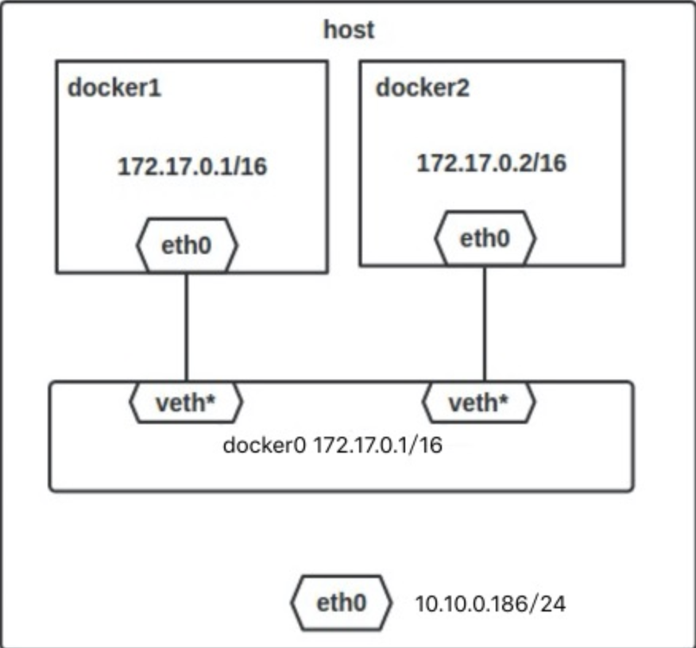

### docker net
+ docker 网络模式
```
host：容器将不会虚拟出自己的网卡，配置自己的IP等，而是使用宿主机的IP和端口。

Container：创建的容器不会创建自己的网卡，配置自己的IP，而是和一个指定的容器共享IP、端口范围。

None：该模式关闭了容器的网络功能。

Bridge：此模式会为每一个容器分配、设置IP等，并将容器连接到一个docker0虚拟网桥，通过docker0网桥以及Iptables nat表配置与宿主机通信。
```

+ birdge模式
当Docker server启动时，会在主机上创建一个名为docker0的虚拟网桥，此主机上启动的Docker容器会连接到这个虚拟网桥上。虚拟网桥的工作方式和物理交换机类似，这样主机上的所有容器就通过交换机连在了一个二层网络中。接下来就要为容器分配IP了，Docker会从RFC1918所定义的私有IP网段中，选择一个和宿主机不同的IP地址和子网分配给docker0，连接到docker0的容器就从这个子网中选择一个未占用的IP使用。如一般Docker会使用172.17.0.0/16这个网段，并将172.17.0.1/16分配给docker0网桥（在主机上使用ifconfig命令是可以看到docker0的，可以认为它是网桥的管理接口，在宿主机上作为一块虚拟网卡使用）
<div align="center">

</div>


+ 命令行
```
docker run --name=nginx_bridge --net=bridge -p 80:80 -d nginx  
docker network ls
docker network inspect container
brctl show
```

+ 示例
```
version: '3.0'
networks:
  backend:
    ipam:
      driver: default
      config:
        - subnet: 192.168.188.0/24

services:

  mysql57:
    container_name: mysql57
    image: mysql:5.7
    ports:
      - 3306:3306
    environment:
      MYSQL_ROOT_PASSWORD: ${MYSQL_ROOT_PASSWORD}
      MYSQL_ROOT_HOST: ${MYSQL_ROOT_HOST}
    volumes:
      - ${MYSQL_DIR}/data:/var/lib/mysql
      - ${MYSQL_DIR}/config:/etc/mysql/conf.d
    networks:
      backend:
        ipv4_address: 192.168.188.2

  mongo:
   container_name: mongo
   image: mongo
   ports:
     - "27017:27017"
   environment:
      MONGO_INITDB_ROOT_USERNAME: ${MONGO_INITDB_ROOT_USERNAME}
      MONGO_INITDB_ROOT_PASSWORD: ${MONGO_INITDB_ROOT_PASSWORD}
   volumes:
     - ${MONGO_DIR}/data/db/:/data/db/
     - ${MONGO_DIR}/etc/mongod.conf:/etc/mongod.conf
     - ${MONGO_DIR}/data/log/:/data/log/
   networks:
     backend:
       ipv4_address: 192.168.188.3

  redis:
    container_name: redis
    image: redis
    ports:
      - 6379:6379
    environment:
      REDIS_PASSWORD: ${REDIS_PASSWORD}
    volumes:
      - ${REDIS_DIR}/conf/redis.conf:/usr/local/etc/redis/redis.conf
      - ${REDIS_DIR}/data/:/data/
    entrypoint: redis-server /usr/local/etc/redis/redis.conf
    networks:
      backend:
        ipv4_address: 192.168.188.4
```
