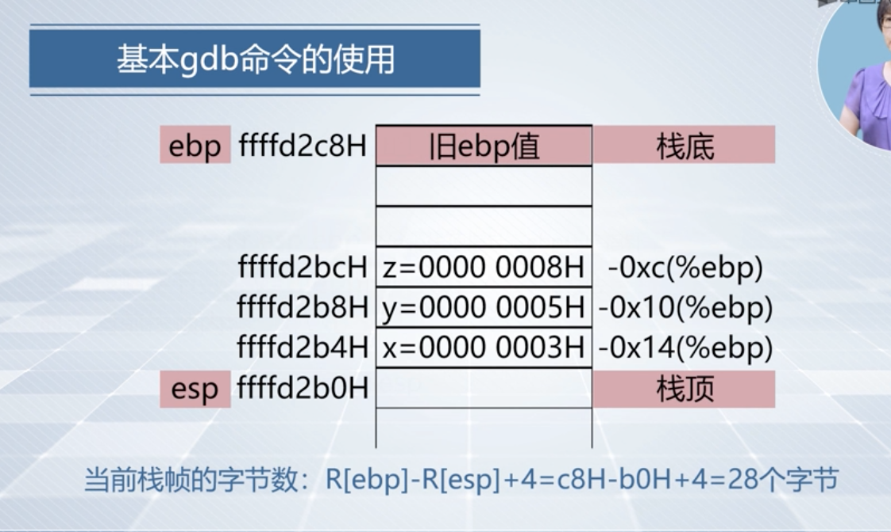

>  gdb命令
+ 启动gdb调试工具，加载要被调试的可执行文件
```
gdb [可执行文件名]

gdb
file [可执行文件名]
```
+ 设置断点
```
break main 
break gdbtest.c:3
```
+ 启动程序运行
```
//启动程序运行，程序会在断点处停下
run  
```
+ 查看程序运行时当前状态
‘’‘
//1.程勋当前断点位置
//含义：反应程序已经执行了哪些指令，下一步要执行哪一条指令
// i r:显示所有寄存器的内容
// i r eip:只显示寄存器 eip 内容
16 bit - ip
32 bit - eip
64 bit - rip

//2.通用寄存器的内容
i r eax ebx ecx edx（或 ir）

//3.存储器的单元内容
x [params];
//存储待单元内容使用十六进制形式
// b/w: 要显示的存储单元的宽度 b：按字节显示，w：按4字节显示
// 8/2: 标示要显示的数据单元的个数
// 0xffffd2bc:要显示的存储单元的起始地址

// 从 0xffffd2bc 地址单元开始，显示8个字节的存储单元内容，并用16进制表示
x/8xb 0xffffd2bc

// 从 0xffffd2bc 地址单元开始的2个32位的存储单元内容，并用16进制表示
x/2xw 0xffffd2bc

四：查看程序运行时的当前状态
说明： IA-32 用栈来支持过程的嵌套调用，过程的入口参数、返回地址，被保存的寄存器的值、被调用过程中的非静态局部变量等都会被保存在栈中。
栈帧： 系统为每个执行的过程分配一个栈空间。
栈帧信息：
当前栈帧范围: i r esp ebp //esp 栈顶指针、ebp栈底指针
当前栈帧字节数： y = R[ebp] - R[esp] + 4 
计算方法：
<div align="center">

</div>

显示当前栈帧内容: 
x/yxb $esp //栈帧起始地址是esp指向的单元地址；
x/zxb $esp //z=y/4,显示从esp指向的地址开始。
’‘’

+ 继续执行下一条指令或语句
```
si : 执行一条机器指令
s : 执行一条C 语句
```

+ 退出调试
```
quit 
```
