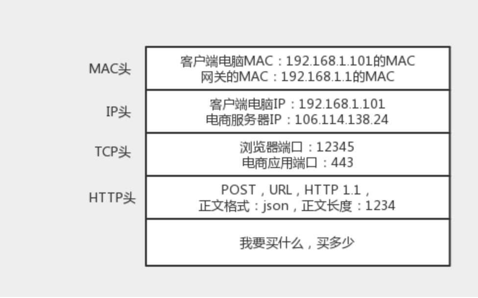
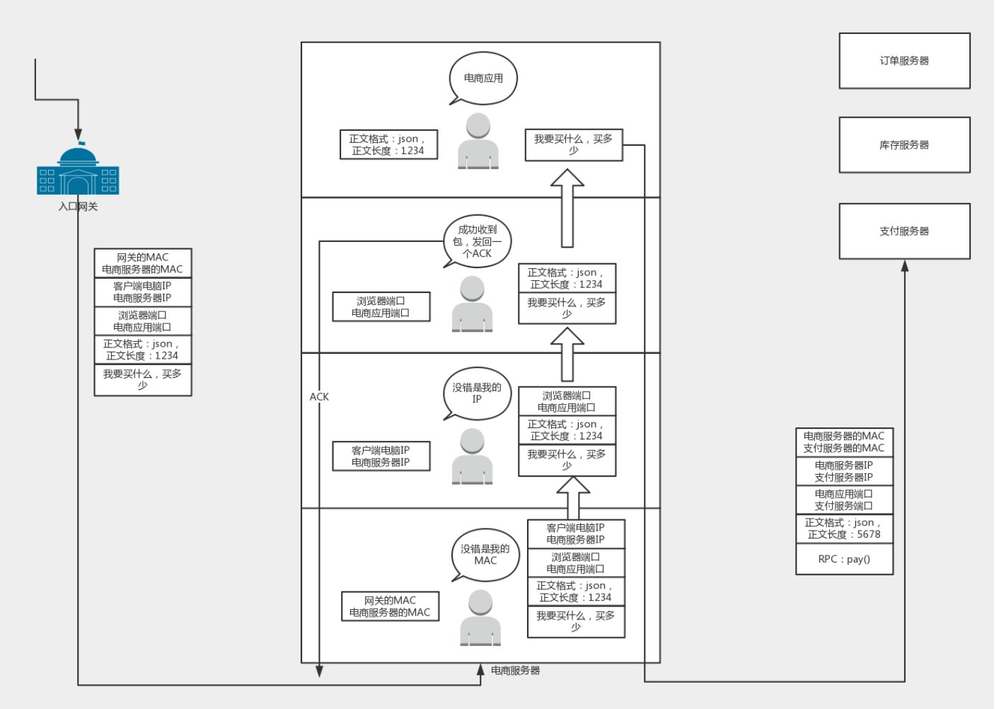
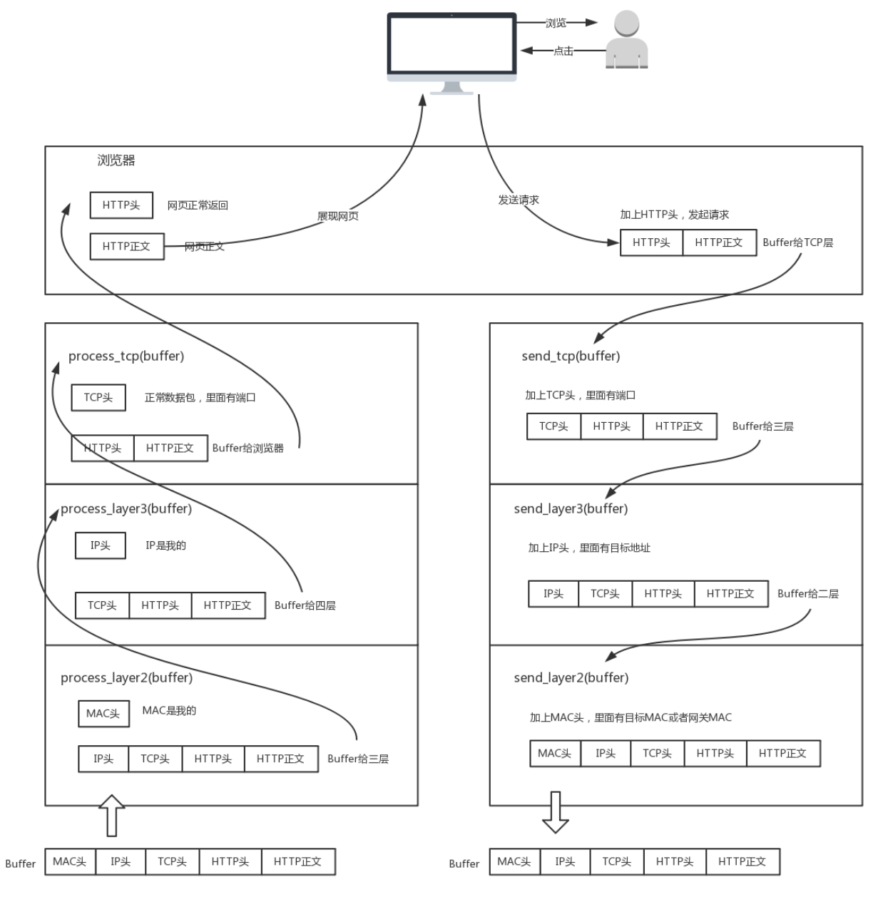
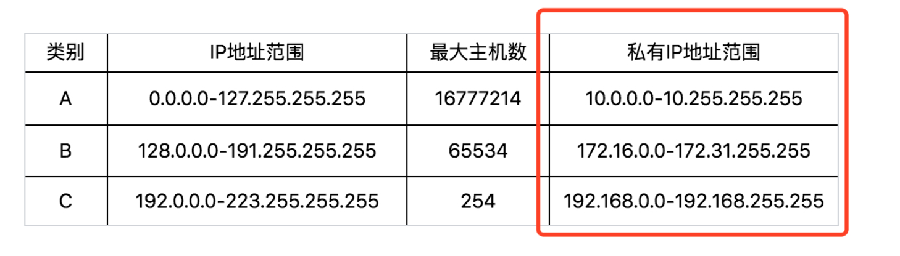
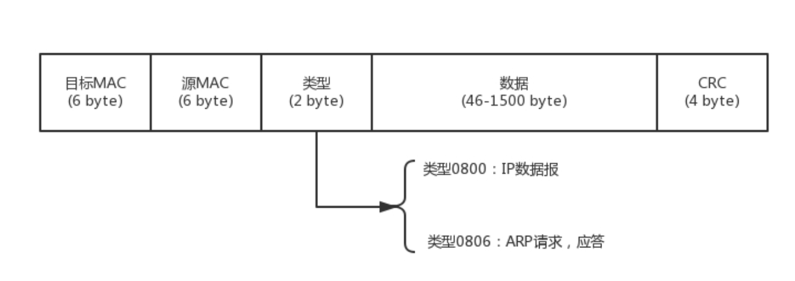
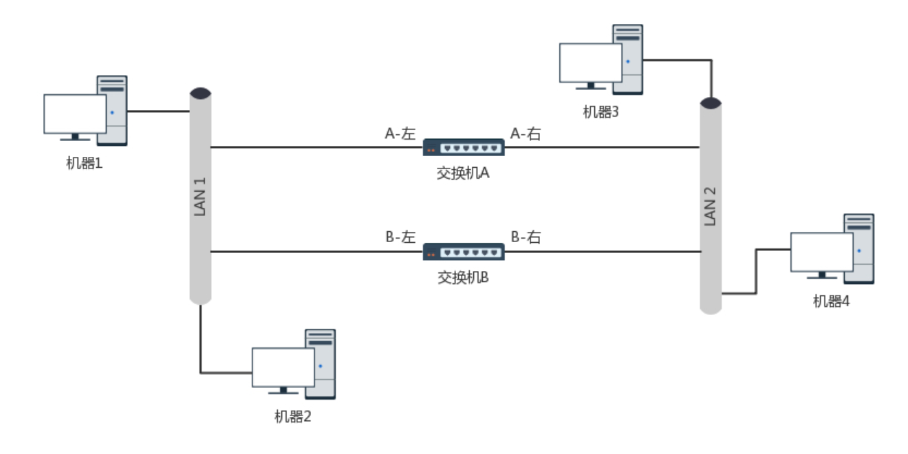
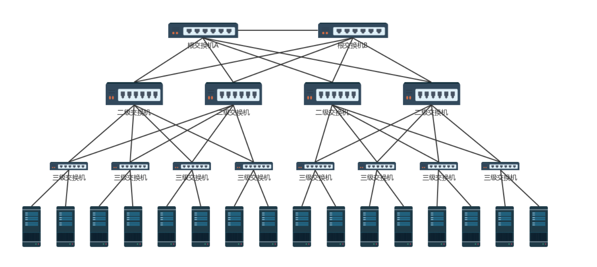
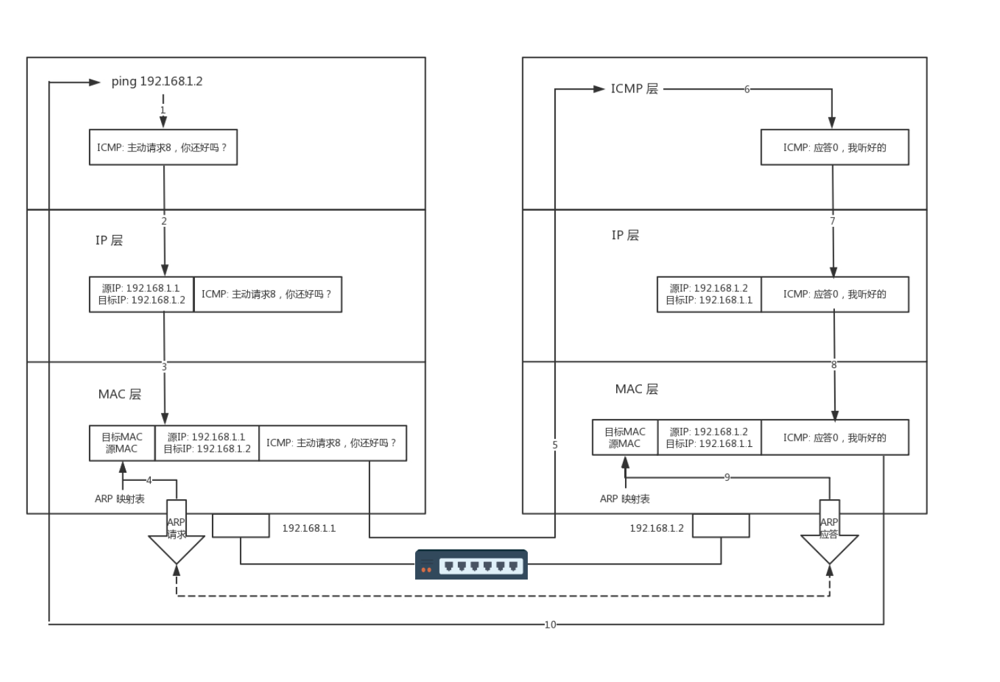

> ### 网络分层
+ 只要是在网络上跑的包，都是完整的。可以有下层没上层，绝对不可能有上层没下层。
<div align="center" height="415" width="100%">



</div>


> ### ifconfig 
```
root@test:~# ip addr
1: lo: <LOOPBACK,UP,LOWER_UP> mtu 65536 qdisc noqueue state UNKNOWN group default 
    link/loopback 00:00:00:00:00:00 brd 00:00:00:00:00:00
    inet 127.0.0.1/8 scope host lo
       valid_lft forever preferred_lft forever
    inet6 ::1/128 scope host 
       valid_lft forever preferred_lft forever
2: eth0: <BROADCAST,MULTICAST,UP,LOWER_UP> mtu 1500 qdisc pfifo_fast state UP group default qlen 1000
    link/ether fa:16:3e:c7:79:75 brd ff:ff:ff:ff:ff:ff
    inet 10.100.122.2/24 brd 10.100.122.255 scope global eth0
       valid_lft forever preferred_lft forever
    inet6 fe80::f816:3eff:fec7:7975/64 scope link 
       valid_lft forever preferred_lft forever
```
+ ip 地址
<div align="center">

</div>

+ mac地址  
link/ether fa:16:3e:c7:79:75 brd ff:ff:ff:ff:ff:ff

+ 网络设备的状态标识
```
UP 表示网卡处于启动的状态；
BROADCAST 表示这个网卡有广播地址，可以发送广播包；
MULTICAST 表示网卡可以发送多播包；
LOWER_UP 表示 L1 是启动的，也即网线插着呢。
MTU1500 是指什么意思呢？是哪一层的概念呢？最大传输单元 MTU 为 1500，这是以太网的默认值。
qdisc 全称是queueing discipline，中文叫排队规则,内核如果需要通过某个网络接口发送数据包，它都需要按照为这个接口配置的 qdisc（排队规则）把数据包加入队列。
```  


> ### 通过ip地址获取端口号、子网掩码和广播地址等
```
10.100.122.2/24
前24位网络号，后8位主机号 
11111111 11111111 11111111 00000000  255.255.255.0  子网掩码
													   &	
00001010 01100100 01111010 00000010  10.100.122.2   ip地址
                                                       = 
00001010 01100100 01111010 00000000  10.100.122.0    网络号

00001000 01100100 01111010 11111111  10.100.122.255    广播地址

16.158.165.91/22

前22位网络号，后10位主机号 

11111111 11111111 111111 00 00000000  255.255.252.0  子网掩码

00001000 11110101 101001 01 01011011  16.158.165.91   ip地址

00001000 11110101 101001 00 00000000  16.158.164.0    网络号

00001000 11110101 101001 11 11111111  16.158.167.255    广播地址

```
> NAT 和 NAPT 
+  NAPT与NAT的区别在于，NAPT不仅转换IP包中的IP地址，还对IP包中TCP和UDP的Port进行转换。这使得多台私有网主机利用1个NAT公共IP就可以同时和公共网进行通信。

> 从物理层到mac层（Medium Access Control） 
+ 数据链路层，媒体访问控制层 
```
+ 1.发给谁，谁接受 
+ 2.往媒体上发数据的时候，谁先发、谁后发的问题。防止发生混乱
+ 3.检测发送是否错误 CRC（循环冗余检测）
```
+ 第二层网络包样式
<div align="center">

</div>
+ 多路访问  
```
信道划分 
轮流协议
随机接入协议
```

+ ARP 是通过吼的方式来寻找目标 MAC 地址的，吼完之后记住一段时间，这个叫作缓存；
ip neigh  // arp -an 

交换机是有 MAC 地址学习能力的，学完了它就知道谁在哪儿了，不用广播了。

+ 环路问题
<div align="center">

</div>

+ 机器 1 访问机器 2 的过程。一开始，机器 1 并不知道机器 2 的 MAC 地址，所以它需要发起一个 ARP 的广播。广播到达机器 2，机器 2 会把 MAC 地址返回来，看起来没有这两个交换机什么事情
+ 但是问题来了，这两个交换机还是都能够收到广播包的。交换机 A 一开始是不知道机器 2 在哪个局域网的，所以它会把广播消息放到局域网二，在局域网二广播的时候，交换机 B 右边这个网口也是能够收到广播消息的。交换机 B 会将这个广播息信息发送到局域网一。局域网一的这个广播消息，又会到达交换机 A 左边的这个接口。交换机 A 这个时候还是不知道机器 2 在哪个局域网，于是将广播包又转发到局域网二。左转左转左转，好像是个圈
+ 机器 1 的广播包到达交换机 A 和交换机 B 的时候，本来两个交换机都学会了机器 1 是在局域网一的，但是当交换机 A 将包广播到局域网二之后，交换机 B 右边的网口收到了来自交换机 A 的广播包。根据学习机制，这彻底损坏了交换机 B 的三观，刚才机器 1 还在左边的网口呢，怎么又出现在右边的网口呢？哦，那肯定是机器 1 换位置了，于是就误会了，交换机 B 就学会了，机器 1 是从右边这个网口来的，把刚才学习的那一条清理掉。同理，交换机 A 右边的网口，也能收到交换机 B 转发过来的广播包，同样也误会了，于是也学会了，机器 1 从右边的网口来，不是从左边的网口来，然而当广播包从左边的局域网一广播的时候，两个交换机再次刷新三观，原来机器 1 是在左边的，过一会儿，又发现不对，是在右边的，过一会，又发现不对，是在左边的
+ 这还是一个包转来转去，每台机器都会发广播包，交换机转发也会复制广播包，当广播包越来越多的时候，按照上一节讲过一个共享道路的算法，也就是路会越来越堵，最后谁也别想走。所以，必须有一个方法解决环路的问题

+ 解决方案 在数据结构中，有一个方法叫作最小生成树。有环的我们常称为图。将图中的环破了，就生成了树。在计算机网络中，生成树的算法叫作STP，全称Spanning Tree Protocol。
<div align="center">

</div>

+ 如何解决广播问题和安全问题
+ 物理隔离  虚拟隔离VLAN

+ ping 查询报文
<div align="center">

</div>

+ 如果离开本局域网，就需要经过网关，网关是路由器的一个网口；
+ 路由器是一个三层设备，里面有如何寻找下一跳的规则；
+ 经过路由器之后 MAC 头要变，如果 IP 不变，相当于不换护照的欧洲旅游，如果 IP 变，相当于换护照的玄奘西行。